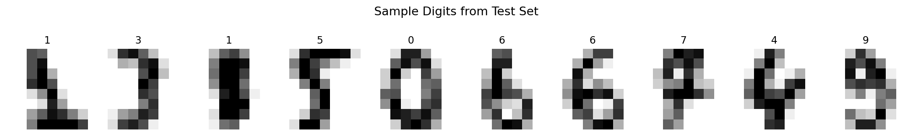
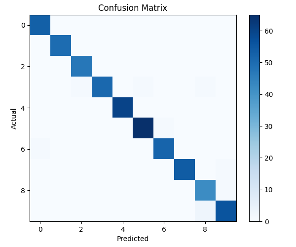

# Image-classifier-using-scikit-learn
This project builds a basic image classifier using scikit-learn to recognize handwritten digits (0–9). It uses the Digits dataset of 8×8 grayscale images, extracts pixel features, and trains a Support Vector Machine (SVM) to classify digits accurately.

## Sample Digits

## Confusion Matrix

